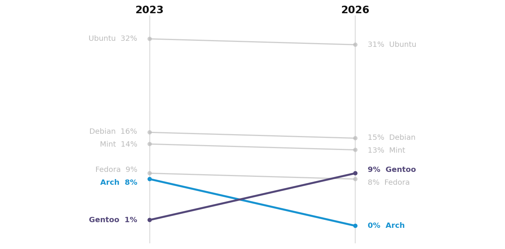

## Project 4: Death by "Userbase Left"



The project includes:

- An "AI" assistant, which tells users to switch to Windows OR executes requests incredibly poorly
- A monthly subscription to the distribution, the payment processor for which does not work (presumably because it was vibecoded)
- An "ad-widget" which comes preinstalled by default
- A fastfetch profile which will not display the logo of the distribution unless on a paid tier
- An override for pacman -Syu which demands that the user purchase a paid tier to have access to updates
- And a "restart system" pop up which activates every thirty seconds.

Media coverage of the change:

[lunamaltseva.dev/breakingnews](https://lunamaltseva.dev/breakingnews)

Install at your own risk. 

---

## Installation

**Requirements:** KDE Plasma 6, Arch Linux, Qt6, CMake, Ninja, `kdialog`, `fastfetch`, `zsh`

```bash
sudo pacman -S qt6-base cmake ninja kdialog fastfetch
```

Then, from the repository root:

```bash
bash install.sh
```

The script builds all Qt apps, installs the pacman hook (prompts for sudo), sets up the zsh wrapper, installs the fastfetch profile, registers the Plasma widget, and adds app launcher entries. It will tell you exactly what to do if anything is missing.

After installation, run `source ~/.zshrc` to activate the pacman wrapper in your current shell.

**To add the ad widget to your desktop:** right-click the desktop → Add Widgets → search for *Ad Widget Pro™*. Place your ad image at `ad-widget/horrible_ad.png` (or configure a path via right-click → Configure on the widget).

**NOT RECOMMENDED — autostart** via System Settings → Autostart:
- `restart-popup/build/restart-popup`
- `ai-assistant/build/ai-assistant`

**To change the AI assistant icon**, edit `~/.local/share/applications/arch-ai-assistant.desktop` and set `Icon=` to a theme icon name or an absolute image path.

## Uninstallation

```bash
bash uninstall.sh
```

Removes the pacman hook, zsh wrapper, fastfetch profile, Plasma widget, and desktop entries. Built binaries in `*/build/` are left in place — delete the repository directory to remove them entirely.